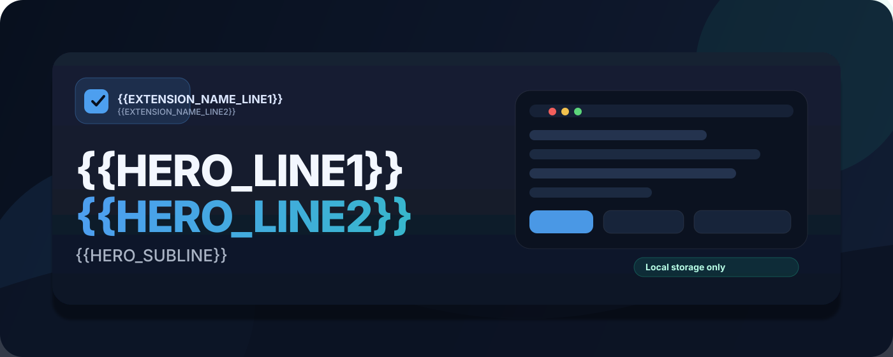
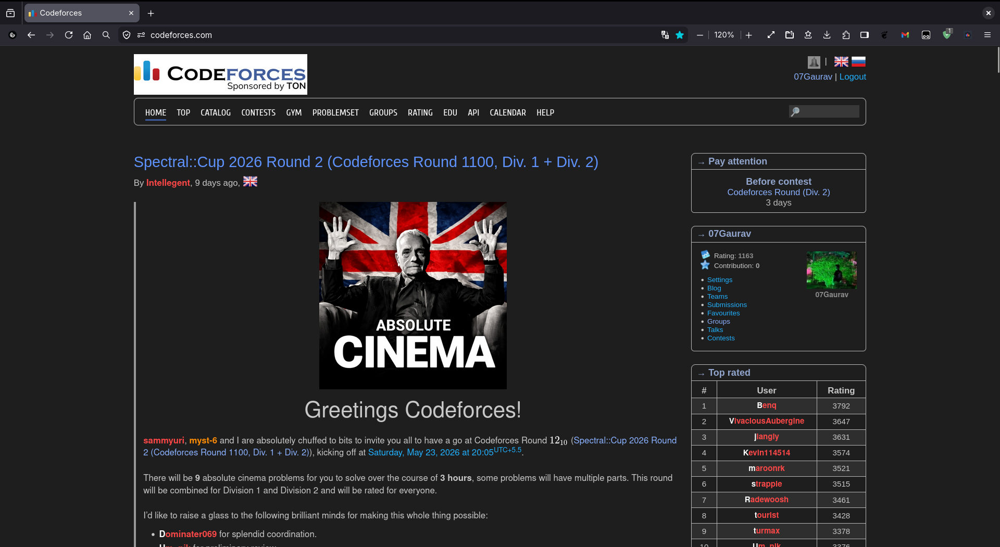

# Browser Extension Template

Replace the placeholder values marked `{{...}}` before publishing a new extension:

- `{{EXTENSION_NAME}}` for the display name
- `{{EXTENSION_SLUG}}` for the short project slug
- `{{EXTENSION_DESCRIPTION}}` for the store and manifest description
- `{{TARGET_DOMAIN}}` for the site your content script should target
- `{{REPO_URL}}` for the repository URL used by popup links and release docs
- `{{AUTHOR_NAME}}` and `{{YEAR}}` for license and attribution text

## Included template files

- `extension/manifest.json`
- `extension/content.js`
- `extension/popup.html`
- `extension/popup.js`
- `extension/popup.css`
- `generate-extension-zip.sh`
- `.github/workflows/release-extension.yml`
- `LICENSE`
- `THIRD_PARTY_LICENSES.md`

# {{EXTENSION_NAME}} — Template Starter

## Overview

This repository is a reusable starter scaffold for small browser extensions. It mirrors the packaging and runtime layout used by Codeforces Dark Theme but replaces project-specific values with template placeholders.

Runtime assets and the unpacked extension live under the `extension/` directory. Use the placeholders `{{EXTENSION_NAME}}`, `{{EXTENSION_SLUG}}`, `{{EXTENSION_DESCRIPTION}}`, `{{TARGET_DOMAIN}}`, and `{{REPO_URL}}` to customize the template for a new project.

## Screenshot

## Quick install (developer mode)

### Chrome / Edge / Brave

1. Download the packaged zip from releases:  
   Releases: `{{REPO_URL}}/releases/tag/{{TAG}}` or direct download: `{{REPO_URL}}/releases/download/{{TAG}}/{{ZIP_NAME}}`
2. Unzip the file to a local folder.
3. Open your Chromium-based browser (Chrome, Edge, Brave) and go to `chrome://extensions/`, or `edge://extensions/`, or `brave://extensions/` as appropriate.
4. Enable "Developer mode" (top right).
5. Click "Load unpacked" and select `manifest.json` from the unzipped folder.
6. Open the target site (e.g., `https://{{TARGET_DOMAIN}}`) and confirm the extension behavior.

### Firefox (temporary)

1. Download the packaged zip from releases:  
   Releases: `{{REPO_URL}}/releases/tag/{{TAG}}` or direct download: `{{REPO_URL}}/releases/download/{{TAG}}/{{ZIP_NAME}}`
2. Unzip the file to a local folder.
3. Open `about:debugging#/runtime/this-firefox` in Firefox.
4. Click "Load Temporary Add-on..." and pick `manifest.json` from the unzipped folder.
5. Open the target site and confirm the extension behavior.

## Sources and licenses

- **This template**: Use `LICENSE` in this repo as the starting point for your project license.
- **Upstream/reference**: The original adapted assets are {{XYZ}}-licensed:
- **Third-party styles**: Document any bundled third-party assets in `THIRD_PARTY_LICENSES.md` (examples: Google Code Prettify — Apache 2.0, Ace editor theme — BSD).

## Contributing

Contributions are welcome. Fork, modify, and submit pull requests. If you adapt third-party assets, be sure to include their license text in `THIRD_PARTY_LICENSES.md`.

## Notes

- The `extension/` folder contains the unpacked extension and any bundled third-party styles.
- Packaging is handled by `generate-extension-zip.sh` at the repo root.
- When redistributing, preserve and include third-party licenses.

## Store listing copy (template)

- **Short description**: {{SHORT_DESCRIPTION}}
- **Long description**: {{LONG_DESCRIPTION}}

## Privacy

This template includes example code that stores a single preference locally using `chrome.storage.local` / `browser.storage.local`. Update the privacy text below to reflect your extension's behavior before publishing.

"This extension stores a single preference locally and does not collect or transmit personal data. It does not include remote analytics or tracking scripts — all runtime assets are bundled locally in the `extension/` folder. The only permission requested in the example manifest is `storage`."

---

For packaging scripts and other resources see the project root (example: `generate-extension-zip.sh`).

## Authors / Attribution

This template was derived from the packaging and layout used by Codeforces Dark Theme.

- Template reference: https://github.com/gaurav7902/codeforces-darktheme
- Maintainer profile (reference): https://github.com/gaurav7902
- Original userscript source: https://github.com/gaurav7902/codeforces-darktheme

   <table><tr>
      <td></td>
      <td style="padding-left:12px">
         <h3><a href="https://github.com/gaurav7902">gaurav7902</a></h3>
         
Template reference author

         

      </td>
   </tr></table>

## License

[MIT License](LICENSE)
